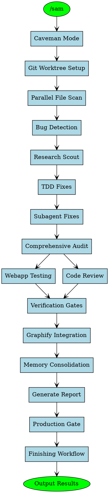
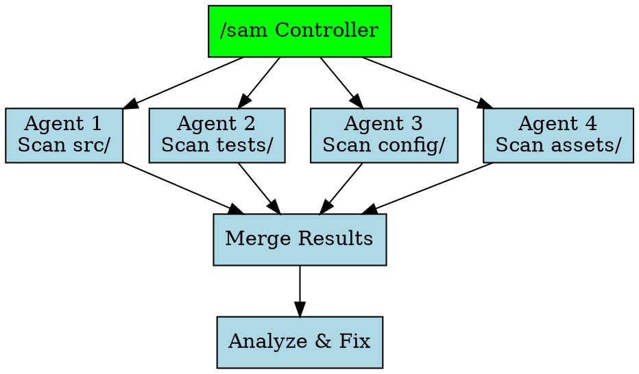

# /sam — Ultimate Project Audit Skill

Full-project scanner with parallel agents, systematic debugging, TDD fixes, verification gates, knowledge graph, webapp testing, research scout. One command does everything.

---

## How It Works

```
User types /sam
        ↓
┌─────────────────────────────────────────────────────────────┐
│  STEP 0: Caveman Mode Activation                              │
│  All responses → ultra-compressed, token-efficient            │
└─────────────────────────────────────────────────────────────┘
        ↓
┌─────────────────────────────────────────────────────────────┐
│  STEP 1: Git Worktree Setup (Isolation)                     │
│  Create isolated workspace → safe to apply fixes            │
└─────────────────────────────────────────────────────────────┘
        ↓
┌─────────────────────────────────────────────────────────────┐
│  STEP 2: Parallel File Scanning                             │
│  Dispatch agents per directory → src/, tests/, config/      │
└─────────────────────────────────────────────────────────────┘
        ↓
┌─────────────────────────────────────────────────────────────┐
│  STEPS 3-4: Bug Detection + Research Scout                  │
│  Find bugs → systematic root cause analysis                 │
│  Unknown bugs → search web/Reddit/HN/Quora                  │
└─────────────────────────────────────────────────────────────┘
        ↓
┌─────────────────────────────────────────────────────────────┐
│  STEPS 5-6: Fix Application (TDD + Subagents)               │
│  Red-green-refactor for every fix                           │
│  Multi-agent workflow for complex fixes                     │
└─────────────────────────────────────────────────────────────┘
        ↓
┌─────────────────────────────────────────────────────────────┐
│  STEP 7: Comprehensive Audit                                  │
│  Bug + Security + Performance + Accessibility checks        │
└─────────────────────────────────────────────────────────────┘
        ↓
┌─────────────────────────────────────────────────────────────┐
│  STEPS 8-9: Webapp Testing + Code Review                    │
│  Playwright verification (if webapp)                        │
│  Request/receive code review for fixes                      │
└─────────────────────────────────────────────────────────────┘
        ↓
┌─────────────────────────────────────────────────────────────┐
│  STEP 10: Verification Gates (20-point checklist)             │
│  Tests pass? Linter clean? Build succeeds? Security OK?      │
└─────────────────────────────────────────────────────────────┘
        ↓
┌─────────────────────────────────────────────────────────────┐
│  STEPS 11-12: Graphify + Memory Consolidation                 │
│  Build deep knowledge graph with communities                │
│  Persist audit state to memory                              │
└─────────────────────────────────────────────────────────────┘
        ↓
┌─────────────────────────────────────────────────────────────┐
│  STEPS 13-14: Report + Production Gate                        │
│  Generate SAM_AUDIT_REPORT.md                               │
│  Calculate human score (0-100)                              │
│  Production gate: SHIP IT or NOT YET                       │
└─────────────────────────────────────────────────────────────┘
        ↓
┌─────────────────────────────────────────────────────────────┐
│  STEP 15: Finishing Workflow                                  │
│  Options: Merge locally / Create PR / Keep / Discard         │
└─────────────────────────────────────────────────────────────┘
        ↓
┌─────────────────────────────────────────────────────────────┐
│  OUTPUT: Caveman summary + Full report + Worktree path       │
└─────────────────────────────────────────────────────────────┘
```

---

## Workflow Visualization

### High-Level Flow



### Bug Fix Workflow

```dot
digraph bug_fix {
    rankdir=LR;
    node [shape=box, style=filled];

    Find [label="Find Bug", fillcolor=lightyellow];
    RootCause [label="Root Cause\nAnalysis", fillcolor=lightblue];
    Research [label="Research Scout\n(if unknown)", fillcolor=lightgreen];
    Red [label="Write Failing\nTest (RED)", fillcolor=lightcoral];
    VerifyRed [label="Verify Test\nFails", fillcolor=lightcoral];
    Green [label="Minimal Code\n(GREEN)", fillcolor=lightgreen];
    VerifyGreen [label="Verify Test\nPasses", fillcolor=lightgreen];
    Refactor [label="Refactor", fillcolor=lightblue];
    Review [label="Code Review", fillcolor=lightyellow];

    Find -> RootCause;
    RootCause -> Research [style=dashed, label="if unknown"];
    RootCause -> Red;
    Research -> Red;
    Red -> VerifyRed;
    VerifyRed -> Green;
    Green -> VerifyGreen;
    VerifyGreen -> Refactor;
    Refactor -> Review;
    Review -> VerifyGreen [label="if issues", style=dashed];
}
```



### Parallel Agent Dispatch



---

## Step 0 — Activate Caveman Ultra Mode

All responses use caveman ultra after /sam runs:
- Drop articles, filler, pleasantries
- Abbreviate: DB/auth/config/req/res/fn/impl
- Arrows for causality: X → Y
- One word when one word enough
- Code blocks stay normal
- Security warnings = full sentences (safety exception)

---

## Step 1 — Git Worktree Setup (Isolation)

**REQUIRED before any fixes.** Create isolated workspace.

```bash
# Check worktree directory
ls -d .worktrees 2>/dev/null || ls -d worktrees 2>/dev/null

# Verify ignored (CRITICAL)
git check-ignore -q .worktrees 2>/dev/null || echo "NEED ADD TO .gitignore"

# Create worktree
git worktree add .worktrees/sam-audit -b sam/audit-$(date +%Y%m%d)
cd .worktrees/sam-audit

# Run setup
npm install 2>/dev/null || pip install -r requirements.txt 2>/dev/null || true

# Verify baseline
git status
```

**Why worktree:**
- Isolated from main branch
- Safe to apply fixes
- Can discard if issues
- No pollution of original

---

## Step 2 — Parallel File Scanning

Dispatch parallel agents per independent domain:

```
Agent 1 → Scan src/ directory
Agent 2 → Scan tests/ directory  
Agent 3 → Scan config/ directory
Agent 4 → Scan assets/ directory
```

Each agent:
1. Finds all files in domain
2. Reads every file
3. Returns file list + initial observations

**When to parallelize:**
- 3+ independent directories
- No shared state between scans
- Different file types (JS, CSS, HTML, config)

**When sequential:**
- Small project (< 20 files)
- Tightly coupled files
- Need full context first

---

## Step 3 — Systematic Bug Detection

### Phase 1: Root Cause Investigation

For each bug found:

1. **Read error messages carefully**
   - Stack traces completely
   - Line numbers, file paths, error codes

2. **Reproduce consistently**
   - Exact steps to trigger
   - Every time or intermittent?

3. **Check recent changes**
   - Git diff, recent commits
   - New deps, config changes

4. **Trace data flow (deep errors)**
   - Where bad value originate?
   - What called this with bad value?
   - Trace up to find source

### Phase 2: Pattern Analysis

- Find similar working code in codebase
- Compare working vs broken
- List every difference
- Understand dependencies

### Phase 3: Hypothesis Formation

- State clearly: "X is root cause because Y"
- Test minimally: smallest possible change
- One variable at a time
- Verify before continuing

### Phase 4: Implementation

**Iron Law: NO FIXES WITHOUT ROOT CAUSE INVESTIGATION FIRST**

**Red flags → STOP and return to Phase 1:**
- "Quick fix for now, investigate later"
- "Just try changing X and see"
- "Add multiple changes, run tests"
- "Probably X, let me fix that"
- "One more fix attempt" (after 2+ failures)
- 3+ failed fixes = architectural problem, discuss with human

---

## Step 4 — Research Scout (Unknown Bugs)

For bugs not understood:

1. **Search web** for error patterns
2. **Search Reddit** — r/webdev, r/programming, r/javascript
3. **Search Hacker News** — hn.algolia.com
4. **Search Quora** — practical experiences

**Query patterns:**
- "{error message} 2026"
- "{technology} bug fix"
- "{framework} issue solution"

**Cross-reference:**
- Compare findings against existing code
- Discard if redundant
- Flag if contradictory
- Validate if genuinely new

**Store in report:**
```
RESEARCH: [bug]
- Source: [URL]
- Finding: [what worked]
- Applied: [yes/no]
```

---

## Step 5 — TDD Fix Application

**Iron Law: NO PRODUCTION CODE WITHOUT FAILING TEST FIRST**

### Red-Green-Refactor for Every Fix

**RED** — Write failing test:
```typescript
test('rejects empty email', async () => {
  const result = await submitForm({ email: '' });
  expect(result.error).toBe('Email required');
});
```

**Verify RED** — Run test, confirm it fails correctly:
```bash
npm test
# FAIL: expected 'Email required', got undefined
```

**GREEN** — Minimal code to pass:
```typescript
if (!data.email?.trim()) {
  return { error: 'Email required' };
}
```

**Verify GREEN** — Run test, confirm passes:
```bash
npm test
# PASS
```

**REFACTOR** — Clean up, keep tests green

---

## Step 6 — Subagent-Driven Fix Implementation

For complex fixes or multiple files:

### Dispatch Pattern

1. **Implementer subagent** → Fixes bug with TDD
2. **Spec reviewer subagent** → Confirms code matches spec
3. **Code quality reviewer subagent** → Reviews implementation

### Model Selection

| Task Type | Model |
|-----------|-------|
| Mechanical (1-2 files, clear spec) | Fast/cheap |
| Integration (multi-file coordination) | Standard |
| Architecture/design/review | Most capable |

### Implementer Status Handling

| Status | Action |
|--------|--------|
| DONE | Proceed to spec review |
| DONE_WITH_CONCERNS | Read concerns, address if correctness issue |
| NEEDS_CONTEXT | Provide missing context, re-dispatch |
| BLOCKED | Assess: context? → re-dispatch; reasoning? → upgrade model; too large? → split task; plan wrong? → escalate to human |

**Never:**
- Skip spec compliance review before code quality review
- Accept "close enough" on spec compliance
- Move to next task with open review issues
- Dispatch multiple implementers in parallel

---

## Step 7 — Comprehensive Audit Checks

### 7.1 Bug Detection

| Check | What to look for |
|-------|-----------------|
| Syntax errors | broken brackets, unclosed tags, missing semicolons |
| Logic bugs | wrong conditions, off-by-one, `<` vs `<=` |
| Undefined vars | variables used before declaration |
| Null/undefined | missing null checks, optional chaining needed |
| Async issues | missing await, unhandled promises, race conditions |
| Console noise | `console.log`, `console.warn`, `console.error`, `debugger` |
| Dead code | unused imports, unreachable code, unused functions |
| Missing files | imports pointing to non-existent files |

### 7.2 Security Audit (40+ checks)

**Critical (full sentences, never caveman):**
- No API keys hardcoded
- No `innerHTML` without sanitization
- No `eval()` usage
- Parameterized queries only
- CORS properly configured
- Auth tokens in httpOnly cookies
- HTTPS enforcement
- Input validation on all boundaries
- CSP headers present
- No secrets in logs/errors

### 7.3 Structure Review

- File organization
- Import/export patterns
- Coupling between modules
- Circular dependencies

### 7.4 Performance Audit

- Asset sizes
- Memory leaks
- Bundle bloat
- Lazy loading opportunities
- Image optimization

### 7.5 Accessibility (WCAG 2.1 AA)

- ARIA labels
- Contrast ratios
- Keyboard navigation
- Alt text on images
- Form labels

### 7.6 Mobile/Responsive

- Viewport meta tag
- Breakpoint coverage
- Touch target sizes
- Responsive images

---

## Step 8 — Webapp Testing (If Applicable)

For web applications, verify fixes with Playwright:

```python
from playwright.sync_api import sync_playwright

with sync_playwright() as p:
    browser = p.chromium.launch(headless=True)
    page = browser.new_page()
    page.goto('http://localhost:5173')
    page.wait_for_load_state('networkidle')
    
    # Test fixed functionality
    page.locator('button#submit').click()
    expect(page.locator('.success')).to_be_visible()
    
    browser.close()
```

**Pattern:**
1. Start server with `with_server.py`
2. Navigate and wait for `networkidle`
3. Screenshot for verification
4. Test user flows
5. Capture console logs for errors

---

## Step 9 — Code Review Integration

### Requesting Review

After fixes applied:

```bash
# Get SHAs
BASE_SHA=$(git rev-parse HEAD~1)
HEAD_SHA=$(git rev-parse HEAD)
```

Dispatch `superpowers:code-reviewer` subagent with:
- What was implemented
- Plan/requirements reference
- BASE_SHA and HEAD_SHA
- Description of changes

**Act on feedback:**
- Fix Critical issues immediately
- Fix Important issues before proceeding
- Note Minor issues for later

### Receiving Review

**Response pattern:**
1. READ complete feedback
2. UNDERSTAND — restate in own words or ask
3. VERIFY against codebase
4. EVALUATE — technically sound?
5. RESPOND — technical acknowledgment or pushback
6. IMPLEMENT — one item at a time, test each

**Never:**
- "You're absolutely right!" (performative)
- "Great point!" (gratitude)
- Implement unclear items
- Blind implementation without verification

---

## Step 10 — Verification Before Completion

**Iron Law: NO COMPLETION CLAIMS WITHOUT FRESH VERIFICATION EVIDENCE**

### The Gate Function

```
1. IDENTIFY: What command proves this claim?
2. RUN: Execute FULL command (fresh, complete)
3. READ: Full output, check exit code, count failures
4. VERIFY: Does output confirm claim?
   - NO: State actual status with evidence
   - YES: State claim WITH evidence
5. ONLY THEN: Make claim
```

### Required Verifications

| Claim | Requires |
|-------|----------|
| Tests pass | Test output: 0 failures |
| Linter clean | Linter output: 0 errors |
| Build succeeds | Build: exit 0 |
| Bug fixed | Original symptom test: passes |
| Security clean | Security scan: 0 critical issues |
| Webapp works | Playwright test: passes |

---

## Step 11 — Graphify Integration (Deep Knowledge Graph)

Build comprehensive knowledge graph:

```bash
/graphify . --mode deep --directed
```

**What graphify adds:**
- God nodes — most connected files
- Communities — clustered related code
- Surprising connections — unexpected links
- EXTRACTED vs INFERRED edges — honest audit trail
- GRAPH_REPORT.md — full analysis

**Integrate into /sam report:**
```
GRAPH: [from graphify]
- God nodes: [files everything depends on]
- Communities: [feature clusters]
- Surprising connections: [unexpected links]
- Cohesion scores: [how tight each cluster]
```

---

## Step 12 — Memory Consolidation

After audit, consolidate to memory:

```
~/.claude/memory/
├── recent-memory.md      # 48hr rolling
├── long-term-memory.md   # Persistent facts
└── project-memory.md     # Project states
```

**What to remember:**
- Project type and stack
- God nodes from graph
- Recurring bug patterns
- Security issues found
- Performance bottlenecks
- What was fixed this session

---

## Step 13 — Generate Audit Report

Create `SAM_AUDIT_REPORT.md` in project root.

### Report Structure

```markdown
# /sam Audit Report
Generated: [date]
Worktree: [path]

## Executive Summary
- Files scanned: [N]
- Bugs found: [N] critical, [N] warnings
- Security issues: [N] critical, [N] warnings
- Console lines removed: [N]
- Dead code removed: [N] items
- Health score: [X]/10
- Human score: [X]/100

## Project Structure Map
[folder tree + god nodes + clusters + dead ends]

## Bug Summary by Severity

### Critical
- [file]: [bug] | WHY: [cause] | FIX: [what was done]

### Warnings
- [file]: [issue] | WHY: [cause] | FIX: [what was done]

## Security Audit
[Full sentences for security issues]

## Performance Audit
[Asset sizes, memory leaks, bundle issues]

## Accessibility Audit
[WCAG compliance issues]

## Graphify Analysis
- God nodes: [list]
- Communities: [list with cohesion scores]
- Surprising connections: [list]

## Research Findings
[Unknown bugs researched, solutions found]

## Console Noise Removed
- [file]: line [N] - [type]

## Dead Code Removed
- [file]: [what was removed]

## Project Health Score
[X]/10 — [reason]

## Human Score Breakdown
[X]/100
- [deduction]: [reason] [points]

## What to Do Next
1. [highest priority]
2. [structural improvement]
3. [feature/refactor suggestion]
4. [testing suggestion]
5. [deployment/performance tip]

## Verification Evidence
- Tests: [command] → [result]
- Linter: [command] → [result]
- Build: [command] → [result]
- Security: [scan] → [result]
```

---

## Step 14 — Production Gate (20-Point Checklist)

Before claiming SHIP IT:

1. All tests pass
2. No console.log/debugger left
3. No hardcoded secrets
4. Security scan clean
5. Linter clean
6. Type check passes
7. Build succeeds
8. No TODO/FIXME in code
9. Error handling present
10. Loading states present
11. Responsive design verified
12. Accessibility checked
13. Performance acceptable
14. No unused imports
15. No dead code
16. Documentation updated
17. CHANGELOG updated
18. Version bumped
19. Git commit clean
20. Code review approved

**SHIPT IT** only if all 20 pass.
**NOT YET** with specific failures if any fail.

---

## Step 15 — Finishing Development Branch

After audit complete, present options:

```
/sam audit complete. What next?

1. Merge fixes back to main locally
2. Push and create Pull Request
3. Keep worktree as-is (handle later)
4. Discard changes

Which option?
```

### Option 1: Merge Locally

```bash
git checkout main
git pull
git merge sam/audit-[date]
git branch -d sam/audit-[date]
git worktree remove .worktrees/sam-audit
```

### Option 2: Create PR

```bash
git push -u origin sam/audit-[date]
gh pr create --title "/sam audit fixes" --body "..."
```

### Option 3: Keep As-Is

Report: "Worktree preserved at [path]. Handle manually."

### Option 4: Discard

**Confirm first:**
```
This will permanently delete:
- Branch sam/audit-[date]
- All commits: [list]
- Worktree at [path]

Type 'discard' to confirm.
```

---

## Caveman Response Template

```
/sam complete. [X] files scanned. [N] bugs. [M] warnings. [K] console lines removed.

CRITICAL:
- [file]: [bug] → [fix applied]

SECURITY:
- [file]: [issue] → [fix applied]

WARNINGS:
- [file]: [issue] → [fix applied]

CONSOLE REMOVED: [N] lines across [M] files

GRAPH: [god node] → [cluster1], [cluster2]...
Dead ends: [file], [file]
Surprising: [connection]

HEALTH: [X]/10 — [reason]
HUMAN SCORE: [X]/100

NEXT:
1. [action]
2. [action]
...

Full report → SAM_AUDIT_REPORT.md
Worktree → [path]
```

---

## Token Budget Rules

- Never repeat info already stated
- Use abbreviations in caveman mode
- One-line per bug in summary
- Full detail in SAM_AUDIT_REPORT.md only
- Graph summary = max 5 lines in chat

---

## Command

Only one command: `/sam`

Does everything — worktree isolation, parallel scan, systematic debugging, research scout, TDD fixes, security audit, performance check, accessibility scan, webapp testing, verification gates, code review, graphify integration, memory consolidation, report generation, human score, finishing workflow.

No flags. No subcommands. Just `/sam`.

---

## Skills Merged (15 Total)

1. **caveman-claude-skill** — Ultra-compressed responses
2. **systematic-debugging** — 4-phase root cause methodology
3. **test-driven-development** — Red-green-refactor for every fix
4. **verification-before-completion** — Evidence before assertions
5. **dispatching-parallel-agents** — Parallel file scanning
6. **subagent-driven-development** — Multi-agent workflow
7. **codepatch** — Security, performance, accessibility audits
8. **using-git-worktrees** — Isolated workspace for fixes
9. **consolidate-memory** — Session memory persistence
10. **finishing-a-development-branch** — Post-audit workflow
11. **requesting-code-review** — Get review for fixes
12. **receiving-code-review** — Handle review feedback
13. **executing-plans** — Multi-session execution
14. **graphify** — Deep knowledge graph
15. **research-scout** — Research unknown bugs
16. **webapp-testing** — Live browser verification
